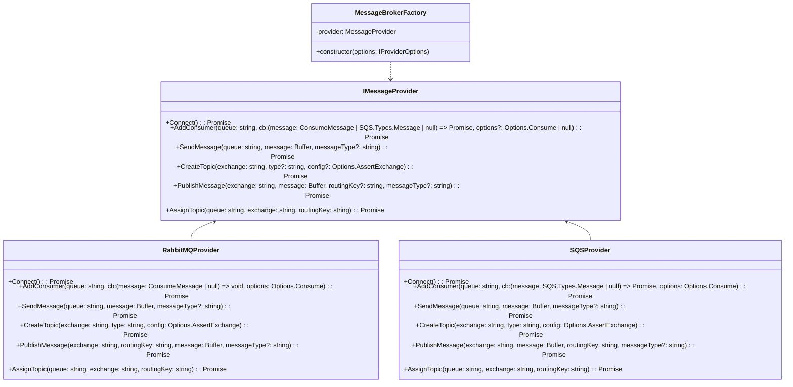
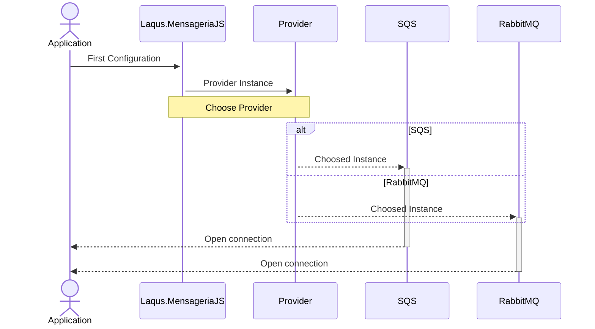
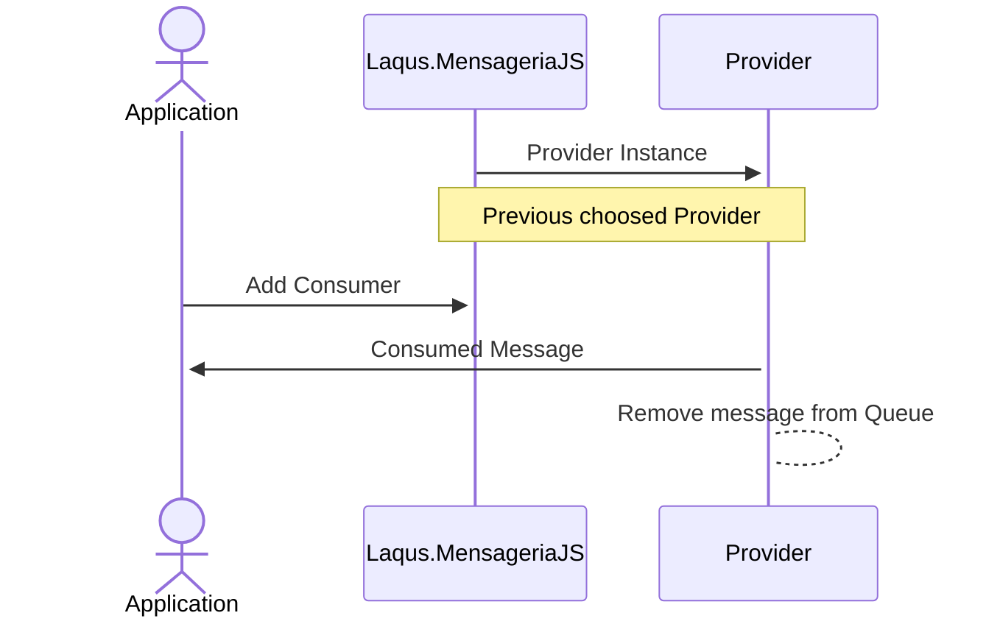
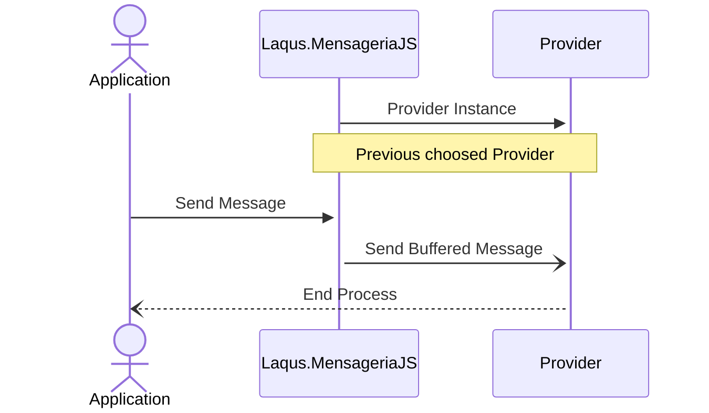
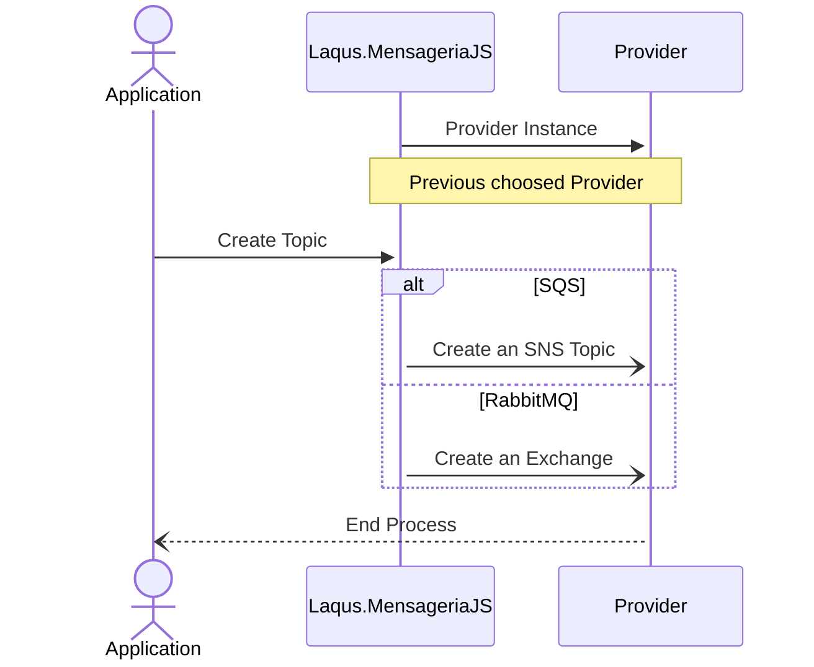
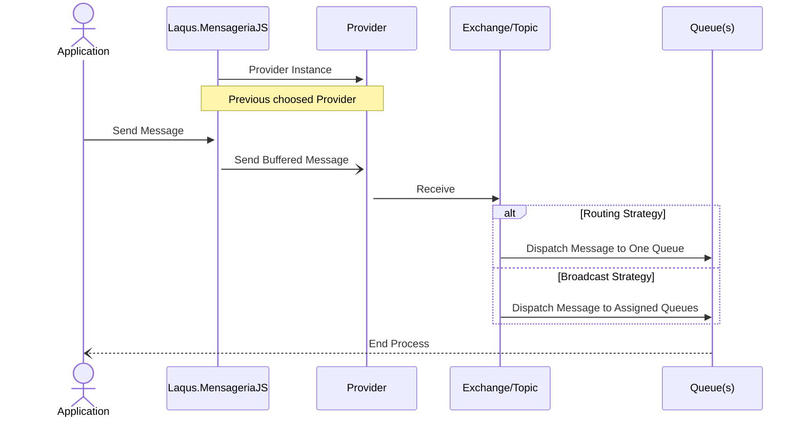
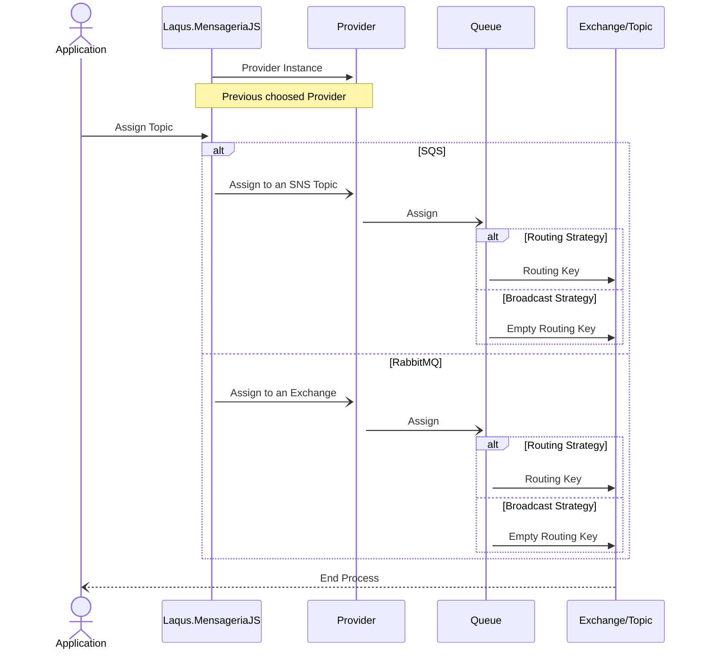

# Laqus Mensageria JS/TS

Esse Projeto de Biblioteca, serve para gerenciamento de mensageria com suporte a diferentes provedores, como RabbitMQ, SQS e futuramente outros; o intuito principal é abstrair de forma simples como gerenciamos esses `Providers`, como para configurar Filas, Exchanges/Tópicos, Pub/Sub no geral.

## Diagrama de Classes



## Súmario
- [Laqus Mensageria JS/TS](#laqus-mensageria-jsts)
  - [Diagrama de Classes](#diagrama-de-classes)
  - [Súmario](#súmario)
    - [**Primeiros passos na Biblioteca**](#primeiros-passos-na-biblioteca)
      - [Instalar Laqus.MensageriaJS em um Projeto](#instalar-laqusmensageriajs-em-um-projeto)
      - [Configurando váriaveis da Biblioteca](#configurando-váriaveis-da-biblioteca)
      - [Broker Types](#broker-types)
    - [**Códigos de Exemplo**](#códigos-de-exemplo)
      - [Conectando a minha Instância](#conectando-a-minha-instância)
      - [Gerenciando um Consumer](#gerenciando-um-consumer)
      - [Gerenciando um Publisher](#gerenciando-um-publisher)
      - [Criando uma Exchange/Topic](#criando-uma-exchangetopic)
      - [Assinando uma Exchange/Topic](#assinando-uma-exchangetopic)
    - [**Tipagem dos Métodos e Interfaces**](#tipagem-dos-métodos-e-interfaces)
      - [Connect()](#connect)
      - [AddConsumer(queue, cb, options?)](#addconsumerqueue-cb-options)
      - [SendMessage(queue, message)](#sendmessagequeue-message)
      - [CreateTopic(exchange, type?, config?)](#createtopicexchange-type-config)
      - [PublishMessage(exchange, message, routingKey?)](#publishmessageexchange-message-routingkey)
      - [AssignTopic(queue, exchange, routingKey)](#assigntopicqueue-exchange-routingkey)
      - [Enum BrokerType](#enum-brokertype)

### **Primeiros passos na Biblioteca**
Podemos gerenciar facilmente um Consumers e Publishers, com poucas linhas de código, abstraindo boa parte da Lógica de Validação, Instanciamento de Filas e Exchanges/Tópicos, a ideia como um todo é que o Desenvolvedor que irá utilizar a Biblioteca não precise conhecer a fundo os Providers e apenas utilize a Biblioteca.

A Biblioteca visa ser totalmente Agnostica, ou seja, o Desenvolvedor não precisa alterar o Fluxo de Funcionamento quando quiser utilizar outro provider, apenas alterar as configurações da Biblioteca e tudo continuará funcionando corretamente.


#### Instalar Laqus.MensageriaJS em um Projeto
Execute o comando:
```bash
    joe@doe:~$ npm install laqus.mensageriajs
```

#### Configurando váriaveis da Biblioteca
Para a configuração inicial dos Providers que serão instânciados, as configurações podem ser passadas via Construtor da Classe principal, como por exemplo:

```typescript
const { MessageBrokerFactory } = require('laqus.mensageriajs');

/* RabbitMQ Example */
const RabbitMQ = new MessageBrokerFactory({
    BrokerType: 'RabbitMQ'
    ConnectionURI: 'amqp://127.0.0.1'
}); // -> required semicolon

/* SQS Example */
const SQS = new MessageBrokerFactory({
    BrokerType: 'SQS'
    Region: 'us-east-1',
    AccessKey: '123456',
    SecretKey: '78910',
    SessionToken: 'optional' // Optional Parameter (Development-only)
}); // -> required semicolon

```
#### Broker Types
- [X] RabbitMQ
- [X] SQS
- [ ] Kafka \(Em Breve)

### **Códigos de Exemplo**
Os códigos a seguir irão funcionar para qualquer tipo de `Provider` existente na Biblioteca, pois ela irá abstrair de forma sucinta a maneira com que as ações são realizadas pelos `Providers`.


#### Conectando a minha Instância
```typescript
(async () => {
    try {
        await Provider.Connect() /* Create Session of Connection */
    } catch (error) {
        console.log(error)
    }
})();
```

#### Gerenciando um Consumer 
```typescript
(async () => {
    try {
        await Provider.Connect()
        await Provider.AddConsumer('Laqus-lib-teste', (msg => /* ... */))

        await Provider.AddConsumer('Laqus-lib-teste', Controller.function.bind(Controller)) /* Bind Strategy per Message */
    } catch (error) {
        console.log(error)
    }
})();
```

#### Gerenciando um Publisher
```typescript
(async () => {
    try {
        await Provider.Connect()
        await Provider.Send('Laqus-lib-teste', Buffer.from('teste')) /* Single Queued Strategy */
        await Provider.PublishMessage('myTopic', Buffer.from('teste')) /* Broadcast Strategy */
        await Provider.PublishMessage('myTopic', Buffer.from('teste')) /* Broadcast Strategy */
        await Provider.PublishMessage('myTopic', Buffer.from('teste'), 'routingKey') /* Broadcast Strategy (Routing) */
    } catch (error) {
        console.log(error)
    }
})();
```

#### Criando uma Exchange/Topic
```typescript
(async () => {
    try {
        await Provider.Connect()
        await Provider.CreateTopic('myTopic', 'direct')
    } catch (error) {
        console.log(error)
    }
})();
```

#### Assinando uma Exchange/Topic
Neste caso existem dois cenários que podem ser utilizados de maneira estrátegica, o Cenário com Roteamente e sem Roteamento.

```typescript
(async () => {
    try {
        await Provider.Connect()
        await Provider.AssignTopic('queue', 'topic') /* Sem Roteamento */
    } catch (error) {
        console.log(error)
    }
})();
```
---

```typescript
(async () => {
    try {
        await Provider.Connect()
        await Provider.AssignTopic('queue', 'topic', 'routingKey') /* Com Roteamento */
    } catch (error) {
        console.log(error)
    }
})();
```

A distinção entre as duas está na forma de receber mensagens, realizando a assinatura de uma Exchange/Tópico com uma Chave de Roteamento, você está dizendo que as Mensagens que chegarem na sua Exchange/Tópico serão direcionados a fila com base nessa chave, caso a Exchange/Tópico não tenha esse Chaveamento, ele irá se comportar normalmente recebendo mensagens.

### **Tipagem dos Métodos e Interfaces**
A interface da MessageBrokerFactory, responsável por realizar os direcionamentos necessários para os Providers criados do `RabbitMQ` e `SQS`, essa inteface Herda alguns tipos dos Providers Originais, de modo que não seja alterado o funcionamento como um todo, mas sim, apenas facilitar o uso.

```typescript
interface IMessageProvider {
    Connect(): Promise<void>;
    AddConsumer(queue: string, cb: (message: ConsumeMessage | SQS.Types.Message | null) => Promise<void>, options?: Options.Consume | null): Promise<void>;
    SendMessage(queue: string, message: Buffer, messageType?: string): Promise<void>
    CreateTopic(exchange: string, type?: string, config?: Options.AssertExchange): Promise<void | string>;
    PublishMessage(exchange: string, message: Buffer, routingKey?: string, messageType?: string): Promise<void>;
    AssignTopic(queue: string, exchange: string, routingKey: string): Promise<void>;
}
```
---

#### Connect()
Conecta-se ao provedor de mensageria. Deve ser chamado antes de usar qualquer outro método.



#### AddConsumer(queue, cb, options?)

Registra um consumidor para processar mensagens em uma fila específica.

- `queue`: O nome da fila a ser consumida.
- `cb`: Uma função de retorno que será chamada para cada mensagem recebida na fila.
- `options` (opcional): Opções adicionais para configurar o consumo, como o tempo de espera e visibilidade.



#### SendMessage(queue, message)

Envia uma mensagem para uma fila específica.

- `queue`: O nome da fila de destino.
- `message`: O conteúdo da mensagem a ser enviada.
- `messageType`: Nome do URN para Associação com o Masstransit. (Exemplo: `Laqus:Exemplo`)



#### CreateTopic(exchange, type?, config?)

Cria um tópico para troca de mensagens entre várias filas.

- `exchange`: O nome do tópico (exchange).
- `type` (opcional): O tipo do tópico (exchange), como "fanout", "direct", etc.
- `config` (opcional): Configurações adicionais para o tópico.



#### PublishMessage(exchange, message, routingKey?)

Publica uma mensagem em um tópico específico.

- `exchange`: O nome do tópico (exchange) de destino.
- `message`: O conteúdo da mensagem a ser publicada.
- `routingKey` (opcional): A chave de roteamento da mensagem.
- `messageType`: Nome do URN para Associação com o Masstransit. (Exemplo: `Laqus:Exemplo`)



#### AssignTopic(queue, exchange, routingKey)

Associa uma fila a um tópico específico para receber mensagens.

- `queue`: O nome da fila a ser associada.
- `exchange`: O nome do tópico (exchange) ao qual a fila será associada.
- `routingKey`: A chave de roteamento para a associação.



---


Interface que define as opções de configuração para a biblioteca de mensageria.

```typescript
interface IProviderOptions {
    BrokerType: BrokerType,
    ConnectionURI?: string,
    Region?: string,
    AccessKey?: string,
    SecretKey?: string,
    SessionToken?: string
}

enum BrokerType {
    RabbitMQ = 'RabbitMQ',
    SQS = 'SQS'
}
```

- `BrokerType`: O tipo de provedor de mensageria a ser utilizado. Deve ser um dos valores do enum `BrokerType`.
- `ConnectionURI` (opcional): A URI de conexão para o provedor de mensageria.
- `Region` (opcional): A região para o provedor de mensageria (apenas para AWS).
- `AccessKey` (opcional): A chave de acesso para autenticação (apenas para AWS).
- `SecretKey` (opcional): A chave secreta para autenticação (apenas para AWS).
- `SessionToken` (opcional): O token de sessão para autenticação (apenas para AWS).

#### Enum BrokerType

Uma enumeração que define os tipos de provedores de mensageria suportados.

- `SQS`: Provedor de mensageria Amazon SQS.
- `RabbitMQ`: Provedor de mensageria RabbitMQ.

